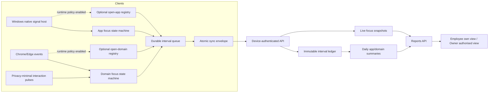

# WorkMap Tracking Clients Final Implementation Plan

Status: implementation-ready architecture blueprint; runtime work described here is not yet complete

Date: 2026-07-17

Targets: Desktop Agent `0.6.0`, Browser Extension `0.5.0`, Tracking Protocol `v2`

Revision basis: current repository baseline Desktop Agent `0.5.10`, Browser Extension `0.4.3`, current v1 queues/checkpoints, current UTC Reports aggregation, current client-type-only pairing flow, current increment-only summaries, PostgreSQL concurrency guarantees, Chrome MV3 production limits, and Windows session/power/input-notification limits.

## 1. Purpose

This document is the implementation source of truth for the next Desktop Agent, Browser Extension, activity ingestion, and Reports changes. It supersedes older diagrams or handoffs that describe either client as only a harness, and it also supersedes the current 10/30-second slice behavior as the intended final design.

The goal is not to infer productivity or hours worked. The goal is to produce a bounded, auditable record of:

- which user-facing application was in the Windows foreground;
- which web hostname was in the active tab of the focused browser window;
- whether Windows-session input was observed while an app was confirmed foreground, or a trusted browser interaction was observed while a hostname was focused;
- when separately approved by policy, how long an eligible application window or web tab remained open;
- whether the client signal was current, delayed, offline, or unavailable.

This plan does not claim that passive reading, meetings, calls, or offline work can be inferred from keyboard and mouse recency.

The two Focus sources have different evidence strength. Windows `GetLastInputInfo` proves only that the current Windows session received input; WorkMap may say that the app was foreground when that session input was observed, but it must not say the input was delivered to that app. The Browser Extension can accept a trusted interaction pulse only from the active tab in the confirmed focused browser window. Reports use the common plain-language label `recent interaction`, while diagnostics retain the source-specific evidence kind.

The core `0.6.0` / `0.5.0` release is the accurate Focus path: `Focus Active`, `Focused Idle`, `Current Focus`, reliable delivery, policy enforcement, and Reports readback. `Open Runtime` remains an optional policy-gated work package. It must not delay or weaken the core Focus release.

## 2. Final Product Decisions

### 2.1 Idle threshold

The release rule is a fixed **60 seconds** from the latest source-specific activity evidence.

- Initial evidence is the boundary at which an app becomes the confirmed foreground app or a hostname becomes the active tab in the confirmed focused browser window. This starts Active immediately but is not described as keyboard/mouse interaction.
- Later Desktop evidence is a newer Windows-session input tick observed while that app was the confirmed foreground app.
- Later Browser evidence is a trusted interaction pulse from the active tab of the confirmed focused browser window.
- `Focus Active`: the app/domain is foreground/focused and its source-specific idle deadline has not passed.
- `Focused Idle`: the same app/domain remains foreground/focused after the deadline.
- Desktop Agent and Browser Extension use the same fixed value.
- The client splits the interval exactly at `lastActivityEvidenceAt + 60 seconds`, even when a sample or MV3 alarm arrives late.
- A configurable company threshold is outside this release. It requires a separately versioned policy, cache, offline, acknowledgement, and effective-time design.
- Reports must say `recent interaction` and `no recent interaction`; they must not equate idle with not working.

Live state starts immediately. Every valid, non-overlapping interval with `durationMs > 0` is committed to the immutable historical ledger. Short intervals may be visually merged or hidden behind an explicit UI grouping rule, but they are never deleted from raw history or summary totals. This prevents a briefly current app/domain from disappearing without a matching historical record.

### 2.2 Metric definitions

| Metric | Exact meaning | Overlap rule | Report rule |
|---|---|---|---|
| App Focus Active | One eligible Windows foreground app during its initial 60-second focus-acquisition window or within 60 seconds of Windows-session input observed while it was foreground | Exclusive per workstation | May be totalled after interval union |
| App Focused Idle | The same foreground app after the threshold | Exclusive per workstation | Separate from Focus Active |
| App Open Runtime | Optional: at least one eligible top-level app window exists while the separate runtime policy is enabled | Non-exclusive across apps | Per-app only; do not present a summed work-time total |
| Domain Focus Active | One HTTP(S) hostname during its initial 60-second focus-acquisition window or within 60 seconds of a trusted pulse from that tab | Exclusive per browser profile; reconciled per workstation | Browser drill-down, never added to browser-app Focus time |
| Domain Focused Idle | The same focused hostname after the threshold | Exclusive per browser profile | Separate from Focus Active |
| Domain Open Runtime | Optional: at least one normal tab for the hostname exists while the separate runtime policy is enabled | Non-exclusive across hostnames | Duplicate tabs are unioned; no summed work-time total |
| Live Current State | Latest client-observed focus snapshot | One focus snapshot per client | May show a provisional UI counter; never write provisional time to history/export |
| Coverage Gap | The collector cannot prove state continuity | Not activity | Display as missing signal, not employee inactivity |

`Open Runtime` is deliberately not called `Visible Time`. Computing true visibility would require occlusion and screen-geometry rules and would still be ambiguous. A minimized app still counts as open; a hidden tray/background process with no eligible top-level window does not.

Open Runtime expands collection beyond the current compliance baseline of foreground activity. It therefore remains off until a separate policy field, employee notice, acknowledgement, retention rule, and legal review explicitly cover open app/window and open tab/hostname collection. When off, clients do not collect the open-window/open-tab set at all; hiding it only in Reports is insufficient. Focus metrics must work independently when this flag is off.

### 2.3 Cross-source rule

Desktop browser-app time and Browser Extension domain time describe the same period at two levels:

- Desktop: `Microsoft Edge` was the foreground application.
- Extension: `github.com` was the focused hostname inside Edge.

They must never be added together. Reports present domains as a drill-down of browser-app time. Open Runtime values are also non-additive.

## 3. Current Repository Assessment

### 3.1 Capabilities to retain

Desktop Agent:

- Cognito/Web pairing to a revocable device credential.
- Electron tray/installer and employee-visible status.
- persistent PowerShell process as a diagnostic fallback;
- credential protection, heartbeat, status events, bounded retry queue, and installer packaging;
- hostname/app-name-only payload boundary and no window-title collection.

Browser Extension:

- MV3 service worker, `tabs`, `windows`, `idle`, `alarms`, and dynamic content-script registration;
- optional HTTP(S) host access, trusted-event filtering, hostname-only extraction;
- pairing, credential vault, queue/retry, status UI, and load-unpacked build.

Backend and Reports:

- server-derived tenant/user identity from device credentials;
- revoke and cross-tenant/cross-user boundaries;
- existing `clientEventId` duplicate-ignore behavior, which must be strengthened with payload and sequence conflict detection in v2;
- app/domain summary APIs, Owner/Employee access checks, access audit, and Platform Admin privacy boundary;
- five-second Reports live polling and stale-signal presentation.

### 3.2 Mechanisms that must change

| Current mechanism | Problem | Required replacement |
|---|---|---|
| Desktop 100 ms foreground polling is the primary switch signal | Bounded but not event-driven; switch accuracy depends on polling | Native `EVENT_SYSTEM_FOREGROUND` hook, with polling only as reconciliation |
| Desktop keeps focus segments in a map by app | More than one app can remain focus-active after a switch | Exactly one foreground focus session per workstation |
| Desktop starts/extends focus from global last-input time | A newly foreground app may not start immediately or may inherit an older input time | Start Active at the foreground boundary; a newer session-input tick only refreshes `lastSessionInputAt` for the confirmed foreground app |
| Desktop/Extension default to 30 seconds | Conflicts with the confirmed 60-second release rule | Fixed 60-second threshold in both clients and Reports copy |
| Browser keeps `activeByTab` across windows | Multiple browser windows can remain active concurrently | Exactly one focused domain session per browser profile |
| Browser creates focus after the first page interaction | Violates `active tab + focused window starts immediately` | Start Active on focus/tab activation; initialize interaction deadline at that boundary |
| Each content-script frame owns an idle timer | Frame timers can race and close/idle the top-level domain incorrectly | Frames emit pulses only; service worker owns one persisted deadline |
| User-started media emits recurring activity | Playback can keep a domain Active without new user interaction | Remove media heartbeat; the initiating click is already an interaction pulse |
| Checkpoints create new 10/30-second session starts | Live duration can reset and requires UI monotonic masking | Fixed session ID/start plus contiguous per-stream sequence cursor |
| `durationSeconds` rounds every small event | Events below one second can disappear and repeated short intervals can inflate totals | Store and aggregate integer milliseconds end to end; round only for display |
| Web/API discard live segments below five seconds | A current app/domain can disappear without entering history | Persist every valid `durationMs > 0`; UI grouping must not alter ledger totals |
| Current app live time is extrapolated from the latest slice start or heartbeat grace | Settled history and inferred time can overlap or fabricate a tail after a crash | Confirmed ledger for official totals; separate provisional snapshot presentation only |
| Current domain comes from the latest closed event | It is delayed and may be stale | Dedicated live domain snapshot with freshness expiry |
| `lastSequenceNumber` advances to any larger value | Receiving sequence 1 then 3 can hide the missing 2 | Contiguous cursor per device/source/clock epoch/stream plus missing ranges |
| Existing client queues trim to 1,000 rows | Oldest offline data is silently lost under pressure | Versioned durable queue, explicit overflow/coverage state, and no silent eviction |
| Server has policies but clients do not fetch/enforce them | Collection can proceed without a complete offline policy contract | Device-scoped policy endpoint, versioned cache, validity period, and server enforcement |
| Pairing code creation sends only `clientType` | Extension cannot be safely attached to a user-selected workstation | Cognito-authenticated workstation selection stored on the one-time code; exchange cannot override it |
| `Device` has no immutable client/browser identity and `DevicePairingCode` has no workstation binding | Desktop uniqueness and browser arbitration cannot be enforced safely under concurrent pairing | Add user/tenant-owned `Workstation`, immutable device identity fields, a database partial unique index, and server-bound pairing intent |
| Current idempotency accepts a unique event ID without a canonical payload hash and does not reserve sequence identity | A reused ID or sequence can silently hide conflicting data | Two database uniqueness constraints, canonical `payloadHash`, and explicit conflict responses |
| Focus overlap is described as an application validation | Two concurrent sync transactions can both pass a query-before-insert check | Serialize a database write lane and enforce a PostgreSQL half-open range exclusion across all clock epochs |
| App/website summaries increment by user/subject and Reports sum them | Simultaneous devices can double-count user/day and company totals | Increment device/subject caches only; reconcile user/day by interval union and company/day from user results |
| `MonitoringPolicy` has `09:00-17:00` but no schedule timezone | Treating existing values as UTC would shift local work schedules | Add an Owner-confirmed IANA monitoring timezone before v2 activation |
| Clients would otherwise interpret schedule timezone/DST independently | C#, JavaScript, and Node can disagree at repeated or nonexistent local times | Server issues concrete lease-scoped UTC collection windows; clients compare UTC only |
| Extension startup reuses stored `focusedWindowId` after querying all tabs | The last-used window can be mistaken for the currently focused one | Re-read the last-focused normal window and require `focused === true` before restoring Focus |
| v1 queue/checkpoint to v2 cutover is undefined | Upgrade can drop or overlap pre-upgrade time | `protocolActivatedAt`, explicit v1 close/drain, v2 time boundary, and upgrade fixtures |
| Reports force runtime to at least Focus Active + Idle | Hides runtime-signal loss and changes observed data | Report measured runtime and coverage separately; do not synthesize it silently |

## 4. End-to-End Architecture



The durable ledger is the only historical, exported, and aggregate source of truth. A live snapshot is temporary current-state evidence, not a second history table. Reports keep confirmed and provisional values separate:

```text
  official device/subject total = accepted immutable intervals for that device/subject
  official user/day Focus total = interval union across that user's devices
  official company/day Focus total = sum of reconciled user/day totals
snapshot-observed provisional segment = [provisionalFromAt, lastObservedAt]
optional animated provisional extension = (lastObservedAt, min(now, source stale cutoff)]
```

`provisionalFromAt` is computed by the server for the current activity session only after reconciling accepted event IDs and the contiguous stream cursor. For the first state in a new epoch, the snapshot's verified `nextIntervalSequence = 1`, an empty cursor at `0`, and the absence of any accepted/rejected position provide a safe UI-only bootstrap from `stateStartedAt`. If that proof fails or the stream has an unresolved sequence gap or overlap, `provisionalFromAt` is null: Reports may still show the current subject/state, but it does not estimate a duration.

The provisional UI segment may animate between fresh snapshots, but it is never written to the ledger, summary, export, or official total. It may decrease when the next client snapshot corrects it. No time after `lastObservedAt` is treated as client-confirmed.

The server validates and hashes canonical payloads outside the write transaction. A short bulk transaction locks the affected device/source/stream write lanes in deterministic order, rechecks overlap against committed rows, inserts new intervals, increments only device/subject caches, marks affected user/UTC-day reconciliation targets, advances contiguous cursors, and replaces a newer live snapshot. A PostgreSQL exclusion constraint remains the final race-proof Focus invariant. User/day and company/day totals are rebuilt from interval union outside that ingest transaction. Event identity and sequence identity are both enforced; a time watermark is auxiliary and never substitutes for gap-aware sequence processing.

## 5. Desktop Agent 0.6.0

### 5.1 Windows signal host

Build a small compiled Windows helper at `apps/desktop-agent/native/windows-activity-host`.

Recommended implementation: C#/.NET Windows single-file `win-x64` helper. It avoids Electron/Node native ABI coupling while providing direct, testable P/Invoke. The existing PowerShell sampler remains an explicit diagnostics fallback and is not the production default.

The helper owns a hidden top-level Win32 window and message loop. Do not use an `HWND_MESSAGE` message-only window for this role because message-only windows do not receive broadcast messages such as the power notifications required here.

The helper emits versioned JSON-lines events over a supervised stdio channel:

- `foreground_changed`: monotonic timestamp, HWND-derived process identity, no title;
- `interaction_pulse`: monotonic timestamp only;
- confirmed `session_locked`, `session_unlocked`, session connect/disconnect, `suspend`, `resume`, and `desktop_switched` signals when Windows provides them;
- optional `open_app_set`: normalized eligible app identities only while the separate Open Runtime policy is enabled;
- `health`: adapter version and recoverable error code.

Windows APIs and rules:

- `SetWinEventHook(EVENT_SYSTEM_FOREGROUND, ...)` is the primary foreground signal.
- `GetForegroundWindow` is used to reconcile missed events every 1 second.
- `GetLastInputInfo` is sampled at a bounded sub-second cadence and emits `session_input_observed` only when its tick advances. The returned tick is used as the evidence boundary, so polling delay does not shift the interval split.
- A newer session-input tick refreshes only the one app confirmed foreground at that instant. It proves session input while that app was foreground, not that the input targeted the app, and it never creates a second Active stream for another monitor.
- `LASTINPUTINFO.dwTime` is a 32-bit tick value. Map it onto the helper's 64-bit monotonic timeline using the unsigned low-32-bit difference from `GetTickCount64`; never compare it as a signed value. The deterministic adapter tests cross the `0xFFFFFFFF -> 0` rollover at approximately 49.7 days.
- A modulo age larger than the bounded policy/signal horizon, or a non-monotonic/injected-input anomaly that cannot be reconciled to the current 64-bit epoch, does not refresh Active. Clamp it to the last proven evidence and emit a privacy-minimal clock-health reason instead of inventing a timestamp.
- `GetLastInputInfo` is never used as an absolute wall clock.
- Register the hidden window with `WTSRegisterSessionNotification`, retry after Remote Desktop Services becomes ready, and pair every registration with `WTSUnRegisterSessionNotification`.
- Process `WM_WTSSESSION_CHANGE` and `WM_POWERBROADCAST` in `WindowProc`; unregister WTS and any explicitly registered power-setting notifications before destroying the window.
- Treat power notifications only as confirmed entry to or return from a low-power state. They cannot reliably distinguish sleep from hibernation.
- Abrupt termination, power loss, and helper/Agent crashes normally have no final Windows event. The server infers the resulting coverage gap from the last confirmed signal and stale heartbeat; it does not fabricate a precise shutdown reason.
- Only when Open Runtime policy is enabled, use `EnumWindows`, top-level style checks, DWM cloaking state, and root-owner checks to build the open-app set every 2 seconds.
- Exclude the Agent itself, shell-only windows, tool windows, hidden tray processes, services, and windows with no user-facing top-level surface.
- Count minimized eligible windows as open. Do not attempt occlusion-based `visible` time.
- Resolve UWP `ApplicationFrameHost` to the hosted application when possible.
- Normalize Electron and multi-process apps by signed executable/product identity, not window title.
- If identity cannot be proven, emit `Unknown application` plus a local diagnostic reason; do not fabricate an app name.
- Document and test the supported boundary for UAC secure desktop, elevated/admin processes, RDP session changes, Fast User Switching, and Windows session disconnects. Unsupported or inaccessible states create coverage gaps rather than invented activity.

The helper never returns window title, document title, key code, key value, mouse coordinates, clipboard, screenshot, or content.

### 5.2 Foreground focus state machine

There is exactly one `AppFocusSession` per workstation:

```text
sessionId
appIdentity
startedAtUtc
startedAtMonotonicMs
state = ACTIVE | IDLE
stateStartedAtMonotonicMs
activeEvidenceAtMonotonicMs
lastSessionInputAtMonotonicMs | null
confirmedThroughMonotonicMs
clockEpochId
nextSequenceNumber
lastObservedAtMonotonicMs
```

Transitions:

| Signal | Exact action |
|---|---|
| First valid foreground app | Start `ACTIVE` immediately; set `activeEvidenceAt` to the foreground event and leave `lastSessionInputAt` null |
| Same foreground app, newer Windows-session input tick | Update `activeEvidenceAt` and `lastSessionInputAt`; keep fixed `sessionId` and `startedAt`; do not claim app-targeted input |
| Idle deadline passes | Close Active interval exactly at `activeEvidenceAt + 60 seconds`; start Idle at that same boundary |
| New session input while Idle and the app is still foreground | Close Idle exactly at the input time; set both evidence/input times and start Active with the same logical session ID and next state sequence |
| Different foreground app | Close old state at switch timestamp; start new app Active at the same timestamp |
| Different window of the same normalized app | Continue the same app session; update HWND only in memory |
| Minimize/loss of valid foreground | Close focus at the event timestamp; Open Runtime follows its separate window rule |
| Confirmed lock, session disconnect, suspend, or orderly shutdown | Close focus at the confirmed signal time and stop provisional presentation |
| Unlock/resume | Reconcile current foreground and start a new Active session at the resume boundary |
| Signal gap beyond 2 seconds | Close confirmed accounting at the last proven observation; record the remainder as a coverage gap |
| Helper/Agent crash, force-kill, or power loss | Preserve already queued intervals; infer stale coverage server-side without inventing a final cause or duration |
| Wall-clock jump | Keep monotonic duration; refresh the UTC anchor and report drift metadata |

The state machine must never contain two overlapping app focus states for the same workstation.

### 5.3 Optional Open Runtime engine

Open Runtime is a separate optional engine and cannot modify Focus totals. It is not part of the core `0.6.0` Focus acceptance gate. If the runtime policy is absent, false, expired, or unacknowledged, the Agent must not enumerate or persist the open-app set.

- Maintain `appIdentity -> openWindowCount` from the reconciled open-app set.
- Start runtime when count changes `0 -> positive`.
- Keep one runtime session when the app has multiple windows.
- Close after two consecutive scans report zero, using the first absent boundary.
- Pause runtime during lock, sleep, disconnected Windows session, outside-hours, or collector coverage gaps.
- Resume only after a fresh open-app scan.
- Settle long runtime sessions in 30-second deltas without resetting their logical session ID.

### 5.4 Runtime supervision

- Electron main supervises the helper and restarts it with bounded backoff.
- The stdio protocol has a version handshake, bounded line size, heartbeat, startup timeout, and malformed-message limit.
- Three helper failures in five minutes move the Agent to `tracking_error`; Reports stop advancing live values.
- Agent pause, policy-not-acknowledged, outside-hours, revoked credential, and unsupported OS are explicit states.
- Heartbeat does not imply tracking is healthy; it carries separate `connectionState` and `collectorState`.
- Preserve the existing Agent startup/tray behavior; this plan does not redesign Windows auto-start.
- Package the helper inside the existing signed Agent build. Release QA covers code signing, SmartScreen reputation expectations, antivirus false-positive checks, helper extraction/launch, update rollback, and missing/corrupt-helper recovery.

## 6. Browser Extension 0.5.0

### 6.1 Focus source of truth

There is exactly one `DomainFocusSession` per browser profile, not one per window or tab.

The session exists only when all are true:

1. the browser owns the OS-focused browser window;
2. that window has an active normal tab;
3. the tab has an HTTP(S) URL with a valid hostname;
4. a valid acknowledged tracking policy allows Domain Focus collection;
5. the browser is not locked and collection is in schedule.

On service-worker startup or wake, call `chrome.windows.getLastFocused({ populate: true, windowTypes: ["normal"] })`, then restore Focus only when the returned window has `focused === true`, a valid ID other than `WINDOW_ID_NONE`, and one active HTTP(S) tab. "Most recently focused" is not accepted as "currently focused." If that proof is absent, close the persisted unproven tail at its last observation and restore `NONE`. Reconcile Chrome idle state, window, tab, hostname, policy, and the old snapshot before starting a new state.

### 6.2 Browser event handling

| Browser signal | Action |
|---|---|
| `tabs.onActivated` | Close previous domain at event time; start new hostname Active immediately |
| `windows.onFocusChanged` to a window ID | Close prior window's domain; start that window's active hostname Active |
| `WINDOW_ID_NONE` | Close Focus immediately; optional Open Runtime continues only if separately enabled |
| Main-frame committed hostname change | Close old hostname and start new hostname Active; same-host path changes continue |
| Tab close/replace/detach | Close affected Focus and, when enabled, Runtime state; reconcile |
| Trusted page interaction | Refresh `lastTrustedInteractionAt`; Idle returns to Active at the interaction timestamp |
| Interaction deadline | Split Active to Idle at the exact persisted 60-second deadline |
| Chrome `idle` | Reinforce/advance to Focused Idle; do not erase the focused-idle interval |
| Chrome `locked` | Close Focus and pause runtime coverage until unlock/reconcile |
| Extension/browser restart | Close unproven tail at last observation, restore queue, query reality, then resume |
| Worker wakes but `getLastFocused()` returns `focused !== true` | Keep `NONE`; do not revive the last-used window or domain |

Use `tabs.onUpdated(changeInfo.url)` for main-frame hostname transitions and avoid an extra `webNavigation` permission. Exact hostname is normalized to lowercase ASCII/punycode. Path, query, fragment, title, and body are discarded before state reaches persistence.

Every trusted tab, window, hostname, interaction, idle, lock, permission, and policy transition persists state and immediately schedules a sync attempt. The service worker does not depend on a permanent in-memory timer or five-second heartbeat to remain alive.

### 6.3 Content script

The content script is required to distinguish recent page interaction from focused-but-idle time. It must remain minimal:

- dynamically register only after optional HTTP(S) host permission is granted;
- run in the isolated world;
- use all frames only so interaction inside embedded work tools is observed;
- emit only `{ type: "interaction", occurredAt }` for trusted `keydown`, `pointerdown`, throttled `pointermove`, `wheel`, `touchstart`, and `touchmove`;
- never emit event key, button, target, coordinates, selection, form value, title, URL, DOM, or content;
- child frames emit pulses only; they do not own idle, blur, media, or checkpoint timers;
- service worker verifies that the sender tab is the active tab of the currently focused window before accepting the pulse;
- remove recurring media-activity messages. Autoplay and continued playback never extend Active; a real click already creates a pulse.

Raw interaction pulses are transient local control signals. They are not written as individual queue rows, logs, analytics events, or API payloads. Only the resulting focus-state boundaries and the minimum live timing fields are synchronized.

Without optional HTTP(S) host permission, the Extension may identify the active hostname through its existing minimal tab permission, but it cannot classify recent page interaction. It reports Domain Focus as unavailable rather than fabricating Active/Idle time. Open Runtime remains disabled unless its separate policy is enabled. Reports show `Interaction permission required`.

### 6.4 MV3 persistence

Persist before yielding from every state transition:

- fixed focus session and state sequence;
- focused window/tab/hostname;
- `activeEvidenceAt`, nullable `lastTrustedInteractionAt`, idle deadline, `confirmedThroughSequence`, and `lastObservedAt`;
- optional open-tab registry and per-hostname runtime sessions only when runtime policy is enabled;
- durable queue and retry metadata.

Use `chrome.storage.local` for small configuration/snapshot state and IndexedDB for the v2 event queue. `chrome.alarms` wakes the worker for reconciliation, settlement, policy refresh, retry, and health sync no more frequently than every 30 seconds in a production-installed extension. The alarm may be delayed and is a recovery mechanism, not the source of event time; late alarms split at the stored deadline.

The current persisted tracker is snapshot version `4`. Version `5` migration must:

- preserve the paired device credential and device identity;
- close or preserve the v1 active checkpoint at `protocolActivatedAt`;
- keep the existing `chrome.storage.local` v1 queue intact until its legacy uploader acknowledges every retained row;
- create the v2 session and IndexedDB queue only at or after the activation boundary;
- recreate the 30-second alarm whenever the worker starts because alarm persistence cannot be assumed across every supported browser/version;
- recover from migration interruption idempotently without starting two focus sessions.

### 6.5 Optional Domain Runtime

This engine is not part of the core `0.5.0` Focus acceptance gate. When the separate runtime policy is off, the Extension queries only the focused window and active tab needed for Focus and does not inventory background tabs.

- When enabled, query tabs from normal browser windows only.
- One or more tabs with the same hostname form one runtime interval per browser profile.
- A background or discarded tab remains open runtime while it remains in the tab strip.
- Different hostnames are non-exclusive and may overlap.
- `chrome://`, `edge://`, extension pages, `file://`, DevTools, PDF internal viewer pages, and all non-HTTP(S) schemes are excluded.
- Incognito collection is disabled by default for Alpha. Enabling it requires an explicit policy and separate regression coverage.

## 7. Mixed-Use Scenario Matrix

| Scenario | Focus result | Runtime result | Reports treatment |
|---|---|---|---|
| Teams foreground, no input | Teams Active immediately, then Idle at 60 seconds | Teams open only if runtime policy is enabled | Active and Idle shown separately |
| Teams -> Edge | Teams closes and Edge starts at one boundary | Both may remain open | No focus overlap |
| Teams and Edge on two monitors | Only Windows foreground app is focused | Both are open | Runtime may overlap; Focus cannot |
| Multiple windows of Teams | One Teams focus identity | One unioned Teams runtime | No per-window duplication |
| Chrome with ten GitHub tabs | One active github.com focus | One github.com runtime | Duplicate tabs do not multiply runtime |
| Chrome active GitHub, background Jira | GitHub focus only | Both hostnames open | Runtime is non-additive |
| Two Chrome windows | Active tab in the one OS-focused Chrome window only | Tabs in both windows count open | Exactly one focused domain |
| Two Chrome windows on the same hostname | Only the active tab in the OS-focused window accrues Focus | Optional hostname runtime is unioned | Focus never doubles for the same hostname |
| Chrome and Edge both open | Only the OS-focused browser should accrue Focus | Both profiles report open domains | Healthy Desktop browser identity resolves the matching Extension; otherwise show profiles separately |
| Chrome and Edge both submit fresh current snapshots | Match only the fresh Extension whose `browserName` equals the healthy Desktop foreground browser on the same workstation | Runtime remains profile-specific | Mark other snapshots conflicting/unresolved; never silently select or add both |
| Desktop Agent + Extension | Edge app and its current hostname share time | App/domain runtimes remain separate | Domain is a drill-down; never add to Edge time |
| Employee uses two computers simultaneously | Each workstation records its own exclusive stream | Each has independent runtime | User Focus total is interval-unioned; device breakdown remains visible |
| App/domain is current for four seconds then switches | The full four-second interval is queued with millisecond precision | Optional runtime follows its own boundary | Current row closes, but history does not disappear |
| Network outage under a valid policy lease | Local states continue and settle to durable queues | Same | Owner sees last signal; pre-expiry history catches up idempotently |
| Network/policy service unavailable beyond 24-hour lease | Close Focus at lease expiry and stop new collection | Runtime also stops | Explicit coverage gap; reconnect does not backfill uncollected time |
| Server receives sequence 1 then 3 | Both unique intervals may enter the ledger; contiguous cursor remains at 1 | Same | Missing sequence 2 is reported until accepted or explicitly rejected |
| Client crash/restart | Unproven tail stops at bounded last observation | Queue and snapshots restore | No restart-to-restart phantom duration |
| v1 client software upgrades while offline | Preserve v1 queue/checkpoint; without a valid cached policy lease, close at the last proven boundary and pause new capture | v2 starts only after online policy/capability confirmation | No silent queue deletion or v1/v2 overlap; the pause is an explicit gap |
| Lock/sleep/RDP disconnect | Focus closes; runtime coverage pauses | No overnight inflation | Technical state shown separately |
| UAC secure desktop/elevated unknown app | Close or mark unknown based on proven signal | Do not invent identity | Coverage limitation visible |
| Browser permission removed | Domain focus becomes unavailable | Runtime continues only if separately enabled and still permitted | Clear limited-tracking state |
| Passive reading/video/meeting | Becomes Focused Idle after 60 seconds without interaction | Remains open only if runtime policy is enabled | Never interpreted as not working |

This covers most Windows knowledge-work and Chromium browsing patterns. It cannot prove human attention, offline work, macOS/Linux activity, protected secure-desktop content, or browser-internal pages.

Unless a row explicitly says otherwise, Runtime results apply only after the separate Open Runtime policy is implemented, acknowledged, valid, and enabled. Core Focus behavior does not depend on Runtime collection.

## 8. Workstation and Device Association

The current repository creates a pairing code from `{ clientType }` only, and the unauthenticated exchange creates a `Device` without a workstation. V2 replaces that ambiguity with a server-owned pairing choice:

1. Add `Workstation(id, companyId, userId, displayName, revokedAt, createdAt, updatedAt)` and nullable `Device.workstationId`.
2. Add immutable `Device.clientType` and nullable immutable `Device.browserName`. A v2 Desktop device must be `DESKTOP_AGENT` with `browserName = null`; a v2 Extension device must be `BROWSER_EXTENSION` with server-normalized `browserName = CHROME | EDGE`. `UNKNOWN` may describe an unclassified legacy row during migration but cannot activate v2 browser arbitration.
3. Add nullable `DevicePairingCode.workstationId`, `workstationMode: "CREATE_NEW" | "EXISTING" | "STANDALONE"`, and nullable `expectedDesktopDeviceId` for an explicitly confirmed Desktop replacement.
4. A Cognito-authenticated `GET /devices/workstations` returns only the current user's non-revoked workstations in the current tenant, including the current active Desktop identity needed to create a compare-and-swap replacement code.
5. The Web setup page chooses the workstation before creating a code. Desktop defaults to `CREATE_NEW` for first install and may select `EXISTING` only for an explicit reinstall/replacement confirmation; Desktop cannot use `STANDALONE`. Extension requires either an existing workstation or an explicit browser-only `STANDALONE` choice and cannot create a workstation implicitly.
6. `POST /devices/pairing-codes` accepts `clientType`, `workstationMode`, optional `workstationId`, and the active Desktop ID being replaced when applicable. The server validates ownership immediately and stores the resolved binding intent on the one-time code.
7. Agent/Extension exchange sends the code and immutable client metadata only. It cannot send, select, or override `workstationId`; an Extension may declare its validated browser family once at exchange, after which the server-owned `Device.browserName` cannot change through snapshots or sync payloads.
8. In the single-use exchange transaction, the server locks the target `Workstation` row with `SELECT ... FOR UPDATE`, revalidates tenant/user/revocation, and compares `expectedDesktopDeviceId` with the current active Desktop. If the binding changed after code creation, return `WORKSTATION_BINDING_CHANGED`; do not revoke the newly paired winner.
9. For a valid explicit replacement, revoke the prior Desktop device and every active credential, then create/bind the new Device and credential in that same transaction. A standalone Extension remains nullable rather than impersonating another workstation.
10. Add a database partial unique index over `Device(workstationId)` where `clientType = DESKTOP_AGENT`, `revokedAt IS NULL`, and `workstationId IS NOT NULL`. This is the final invariant that one workstation has at most one effective Desktop even if two exchange requests race.
11. Chrome and Edge devices, including separately paired browser profiles, may share one workstation while keeping separate device IDs, immutable browser names, credentials, health, and revocation. Their Focus intervals are allowed to overlap because Windows cannot always identify the exact profile; Reports union/arbitration handles that evidence explicitly.
12. Credential resolution verifies `DeviceCredential.clientType = Device.clientType`. Browser intervals and snapshots must equal the bound `Device.browserName`; Desktop payloads must not carry a browser-profile identity except the separately normalized current foreground app identity used for matching.
13. A device credential can write only for its bound tenant, user, client type, device, and workstation. It cannot mutate workstation membership or read Reports.

The additive migration introduces `Device.clientType` and `Device.browserName` as nullable. It backfills `clientType` only when active credential history gives one unambiguous value, and backfills an Extension `browserName` only when retained client/activity metadata consistently identifies one supported browser family. Ambiguous rows remain `UNKNOWN`/quarantined and must be repaired or re-paired before v2 activation; they are never guessed. After duplicate active Desktop bindings are resolved, a customized PostgreSQL migration creates the partial unique index; this database invariant is not deferred to a TypeScript check.

Current-domain arbitration is server-owned:

- A healthy, fresh Desktop snapshot whose stable foreground-app identity is server-classified as Chrome or Edge resolves only a fresh Extension snapshot whose server-owned Device identity has the same `workstationId` and immutable `browserName`. Desktop does not claim a browser profile ID.
- If more than one fresh Extension profile has that same browser name on the workstation, Desktop cannot prove which profile owns the foreground window. Reports shows those profiles as unresolved instead of choosing one.
- A fresh Extension for another browser/profile remains visible as `conflicting` or `unresolved`; it is not silently chosen and its current provisional time is not added to the resolved domain.
- When Desktop is stale, unavailable, standalone, or absent, Reports shows each Extension profile separately. It does not invent one workstation-wide current domain.
- Historical domain intervals remain profile/device evidence and are deduplicated/unioned by the aggregation rules; live arbitration never rewrites history.
- Every Extension startup/wake must re-prove `window.focused === true`; a stored or last-used window is insufficient.

This lets Reports correlate `Edge -> github.com`, expose contradictory signals honestly, and avoid presenting simultaneous browser Focus on one workstation as resolved fact.

## 9. Tracking Protocol v2

### 9.1 Canonical interval

```ts
type ActivityIntervalV2 = {
  clientEventId: string;
  activitySessionId: string;
  sequenceNumber: number;       // monotonic within device/source/clockEpochId/stream
  source: "DESKTOP_APP" | "BROWSER_DOMAIN";
  stream: "FOCUS" | "OPEN_RUNTIME";
  metric: "FOCUS_ACTIVE" | "FOCUS_IDLE" | "OPEN_RUNTIME";
  subjectKey: string;           // stable app identity key or normalized hostname key
  displayName: string;          // normalized app label or hostname for presentation
  browserName?: "CHROME" | "EDGE";
  startedAt: string;            // UTC wall-clock projection
  endedAt: string;
  clockEpochId: string;
  startedMonotonicMs?: number;
  endedMonotonicMs?: number;
  durationMs: number;           // positive integer; never rounded to seconds in storage
  policyVersion: string;
  policyLeaseId: string;        // opaque server-issued lease bound to this device/policy/window set
};
```

The client does not send `companyId`, `userId`, or role. The server derives them from the device credential.

Desktop intervals include monotonic bounds from one Windows-helper clock epoch. Browser service-worker restarts create a new `clockEpochId`; browser intervals use persisted UTC boundaries plus sequence and bounded-observation checks when monotonic bounds cannot span the restart. A clock epoch is never compared directly with another epoch. `policyLeaseId` is not a credential; the server resolves it to the exact device/user/policy-bound UTC windows under which the interval was captured.

Identity rules:

- A Desktop `subjectKey` is derived from a privacy-safe canonical application identity: UWP package family when available, otherwise normalized publisher/product/original-filename identity, with a bounded executable-family fallback. The persisted key never contains a full executable path, window title, document name, or command line.
- Desktop `displayName` is the normalized user-facing product/app name. Two apps with the same display label but different keys remain separate. A display-name change for the same stable key remains one history subject with an alias history.
- A Browser `subjectKey` is the normalized lowercase ASCII/punycode hostname with a source prefix; `displayName` is that hostname. Path, query, fragment, page title, and content never enter either field.
- The server stores an `ActivitySubject` registry keyed by tenant, source, and `subjectKey`, validates the key/display pair, and keeps display aliases. Reports group by `subjectKey` and render `displayName`; they never use mutable display text as the primary identity.
- Legacy v1 app/domain rows keep an explicit legacy subject key and are not silently merged with a v2 key unless a reviewed deterministic alias maps them.

### 9.2 Live snapshot

```ts
type LiveFocusSnapshotV2 = {
  snapshotSequence: number;     // monotonic within device/source/clockEpochId
  activitySessionId: string | null;
  currentStateId: string | null;
  source: "DESKTOP_APP" | "BROWSER_DOMAIN";
  stream: "FOCUS";
  clockEpochId: string;
  policyVersion: string;
  policyLeaseId: string;
  subjectKey: string | null;
  displayName: string | null;
  browserName?: "CHROME" | "EDGE";
  state: "ACTIVE" | "IDLE" | "NONE";
  sessionStartedAt: string | null;
  stateStartedAt: string | null;
  lastActivityEvidenceAt: string | null;
  activityEvidenceKind:
    | "FOCUS_ACQUIRED"
    | "WINDOWS_SESSION_INPUT_WHILE_FOREGROUND"
    | "TRUSTED_PAGE_INTERACTION"
    | null;
  latestEmittedIntervalSequence: number | null;
  latestEmittedClientEventId: string | null;
  nextIntervalSequence: number; // next canonical Focus interval position; starts at 1 per epoch
  lastObservedAt: string;
  collectorState: "HEALTHY" | "LIMITED" | "PAUSED" | "ERROR";
};
```

`currentStateId` is created once at an Active/Idle state boundary, survives snapshot retries, and is null for `NONE`. `browserName` is required for `BROWSER_DOMAIN`, must equal the immutable server-owned Device browser identity, and is prohibited for `DESKTOP_APP`. `latestEmittedIntervalSequence` and `latestEmittedClientEventId` identify the exact canonical interval immediately before the provisional current segment; they do not claim server acceptance. `nextIntervalSequence` is allocated from the same Focus stream cursor and is persisted with client state before the snapshot is sent; it never advances the server cursor by itself.

The server derives `provisionalFromAt` by one of two proofs:

1. Normal continuation: both latest-emitted fields resolve to the same accepted immutable interval immediately before the current state, and that row's session, epoch, stream, policy lease, event ID, and sequence match the snapshot; `nextIntervalSequence = latestEmittedIntervalSequence + 1`, and the cursor is contiguous through that prior sequence.
2. First state in an epoch: both latest-emitted fields are null, `nextIntervalSequence = 1`, the matching server cursor is absent or `contiguousThroughSequence = 0`, there is no accepted interval or tombstone at any sequence in that epoch/stream, and `stateStartedAt` is at or after the activation/epoch/policy-window boundary.

Only the second proof permits `stateStartedAt` to become an immediate UI-only provisional baseline before the first 15/30-second settlement. It does not create sequence `1`, advance a cursor, or add confirmed duration. Any mismatch, gap, overlap, stale snapshot, invalid lease window, or later evidence that sequence `1` already existed sets `provisionalFromAt = null` until ledger reconciliation succeeds.

The snapshot describes current client-observed state. It does not assert that all prior interval sequences were received. Within one epoch, only a larger `snapshotSequence` can replace the row. A newly registered epoch may supersede the previous active epoch under bounded server-receipt/clock checks; after that, a delayed snapshot from the old epoch cannot replace the current one. Valid late historical intervals from the old epoch may still enter its own ledger/cursor and reconciliation path. The server joins the accepted current snapshot to the server-owned contiguous cursor before returning live Reports data.

### 9.3 Client health contract

`ClientHealthV2` is a defined, privacy-minimal status object rather than an unspecified placeholder:

```ts
type ClientHealthV2 = {
  clientType: "DESKTOP_AGENT" | "BROWSER_EXTENSION";
  clientVersion: string;
  platform: "WINDOWS" | "CHROME" | "EDGE";
  connectionState: "ONLINE" | "OFFLINE" | "AUTH_REQUIRED" | "UPGRADE_REQUIRED" | "ERROR";
  collectorState: "HEALTHY" | "LIMITED" | "PAUSED" | "ERROR";
  policyState: "ACTIVE" | "ACKNOWLEDGEMENT_REQUIRED" | "TIMEZONE_REQUIRED" | "EXPIRED";
  migrationState: "V1" | "PREPARING_V2" | "DRAINING_V1" | "V2" | "ERROR";
  queue: {
    pending: number;
    ready: number;
    deadLetter: number;
    oldestQueuedAt: string | null;
    nextRetryAt: string | null;
  };
  lastSuccessfulHeartbeatAt: string | null;
  lastSuccessfulSyncAt: string | null;
  errorCode:
    | "NONE"
    | "NATIVE_HELPER_UNAVAILABLE"
    | "INTERACTION_PERMISSION_REQUIRED"
    | "QUEUE_PRESSURE"
    | "POLICY_UNAVAILABLE"
    | "CLOCK_UNTRUSTED"
    | "UPGRADE_REQUIRED"
    | "UNKNOWN";
};
```

Health never includes credentials, pairing codes, authorization headers, arbitrary exception text, window titles, URLs, or content. The API derives tenant/user/device/workstation identity from the credential rather than accepting those fields from health. Client-reported connection state is diagnostic; server receipt time and source-specific stale rules remain authoritative for Reports freshness.

### 9.4 Atomic sync endpoint

Add `POST /device-client/sync-v2`:

```ts
type TrackingSyncRequestV2 = {
  protocolVersion: 2;
  protocolActivatedAt: string;
  clientInstanceId: string;
  sentAt: string;
  intervals: ActivityIntervalV2[];
  focusSnapshot?: LiveFocusSnapshotV2;
  health: ClientHealthV2;
};
```

There is intentionally no envelope-level `clientSequence`. Canonical intervals already own stream sequence identities, snapshots own `snapshotSequence`, and health freshness is based on server receipt. Retrying a transport envelope is therefore item-idempotent and cannot introduce a second undefined ordering authority.

The response is itemized:

```ts
type TrackingSyncResponseV2 = {
  results: Array<{
    clientEventId: string;
    status: "ACCEPTED" | "DUPLICATE" | "REJECTED";
    rejectionCode?:
      | "IDEMPOTENCY_CONFLICT"
      | "SEQUENCE_CONFLICT"
      | "FOCUS_OVERLAP"
      | "INVALID_INTERVAL"
      | "POLICY_REJECTED"
      | "UPGRADE_REQUIRED"
      | string;
    terminal?: boolean;
  }>;
  cursors: Array<{
    source: "DESKTOP_APP" | "BROWSER_DOMAIN";
    stream: "FOCUS" | "OPEN_RUNTIME";
    clockEpochId: string;
    contiguousThroughSequence: number;
    latestAcceptedEndedAt: string | null;
    missingRanges: Array<{ from: number; to: number }>;
    rejectedRanges: Array<{ from: number; to: number; code: string }>;
  }>;
  acceptedSnapshotSequence: number | null;
  serverTime: string;
  activePolicyVersion: string;
  activePolicyLeaseId: string | null;
};
```

Processing rules:

1. authenticates the device credential and checks revoke/client/workstation binding;
2. loads the device-scoped policy once and rejects user/tenant/role fields and all forbidden content fields;
3. validates the envelope before opening a transaction;
4. normalizes each allowed payload, computes its canonical `payloadHash`, and validates sequence, stream, same-epoch monotonic duration when present, UTC projection, activation boundary, policy version/lease window, age, future skew, within-request overlap, subject identity, and payload limits;
5. marks invalid rows `REJECTED` without preventing unrelated valid rows from proceeding; a safely identified non-retryable row receives a stored terminal sequence disposition and coverage-gap reason;
6. in one short transaction, creates every missing `ClientWriteLane(deviceId, source, stream)` through `INSERT ... ON CONFLICT DO NOTHING`, then locks all affected rows with `SELECT ... FOR UPDATE` in lexicographic lane-key order so concurrent syncs for one collector stream serialize without deadlocking unrelated streams; a snapshot-only request still locks its Focus lane;
7. after the lane lock, performs one set-based overlap query against committed Focus intervals for that device/source/stream across all `clockEpochId` values, then inserts immutable valid rows with both `UNIQUE(deviceId, clientEventId)` and `UNIQUE(deviceId, source, stream, clockEpochId, sequenceNumber)`;
8. relies on a PostgreSQL exclusion constraint over the half-open Focus range `[startedAt, endedAt)` as the final concurrent-write invariant; a TypeScript query-before-insert check is only an error-quality optimization and can never be the sole protection;
9. classifies a matching ID/sequence and matching hash as `DUPLICATE`; returns terminal `IDEMPOTENCY_CONFLICT` for a reused ID with a different canonical hash, `SEQUENCE_CONFLICT` for a reused sequence identity with different event content, and `FOCUS_OVERLAP` for a conflicting canonical Focus interval; no conflict overwrites the first immutable row;
10. groups newly inserted rows by device, subject key, UTC day, and metric before incrementing device-level caches, and marks affected user/day reconciliation targets; it never performs one summary query/update per interval;
11. stores accepted out-of-order rows but advances each cursor only through the largest contiguous run of final dispositions: accepted, duplicate, or terminally rejected;
12. records compact missing and terminally rejected sequence ranges; updates auxiliary `latestAcceptedEndedAt` only from accepted intervals and never converts a rejected range into duration;
13. updates the live snapshot only when its same-epoch sequence is newer, or when a valid newly registered epoch supersedes the old one; delayed old-epoch snapshots cannot overwrite current state, and no provisional tail becomes history;
14. returns `ACCEPTED`, `DUPLICATE`, `REJECTED`, conflict, cursor, missing-range, snapshot, server-time, and policy results.

Limits for Alpha:

- 50 intervals or 256 KB per request initially; raise only after Supabase/Postgres load measurements;
- one interval at most 30 minutes; long sessions settle into deltas;
- duration derived from monotonic bounds and checked against `durationMs` within 1 second;
- every valid interval has integer `durationMs > 0`; no five-second or one-second historical minimum;
- future skew at most 5 minutes;
- offline age at most the configured retention window;
- app/hostname length and character constraints;
- no overlapping Focus intervals in one device/source/stream, including intervals from different clock epochs. Adjacent half-open intervals are valid.

Different Browser Profile devices have different `deviceId` values and are intentionally not covered by the same exclusion lane. Their simultaneous evidence is preserved for later workstation arbitration and user/day interval union. A replaced/revoked Desktop cannot submit new rows; its pre-revocation history remains separate evidence and is reconciled rather than destructively rewritten.

Authentication failure, revoked credential, unsupported protocol, or structurally invalid envelope rejects the request. A bad individual interval does not reject the rest of a retained offline batch. Clients acknowledge and remove `ACCEPTED` and `DUPLICATE` rows. A terminal `REJECTED` row moves once to a local dead-letter record with a non-sensitive reason and creates a server coverage gap; a retryable request failure remains queued.

### 9.5 Idempotency and contiguous cursor semantics

Event identity and stream position are independent invariants:

```text
event identity    = deviceId + clientEventId
sequence identity = deviceId + source + stream + clockEpochId + sequenceNumber
```

The server computes SHA-256 `payloadHash` from a stable-key-order canonical JSON representation after normalization. The hash covers every semantic interval field, including session, sequence, source, stream, metric, subject key/display name, browser name, timestamps, monotonic bounds, duration, epoch, policy version, and policy lease ID. It excludes transport-only envelope fields and server-derived tenant/user/role/device/workstation fields. Protocol v2 freezes this canonicalization as version 1; changing normalization or hash inputs requires an explicit canonicalization/protocol version so a retry cannot conflict merely because the server was redeployed.

- Same event identity plus the same canonical hash is a duplicate.
- Same event identity plus a different hash is terminal `IDEMPOTENCY_CONFLICT`.
- Same sequence identity plus the same event ID/hash is a duplicate.
- Same sequence identity plus a different event ID or hash is terminal `SEQUENCE_CONFLICT`.
- A conflict never mutates the accepted row. It advances no unrelated cursor gap and is exposed as collector/coverage health requiring reconciliation.

Each cursor is keyed by:

```text
deviceId + source + stream + clockEpochId
```

If the server receives sequences `1` and `3`, both unique intervals may enter the ledger and mark their dates for reconciliation, but `contiguousThroughSequence` remains `1` and `missingRanges` contains `2-2`. When `2` later arrives, the cursor advances through `3`. A later timestamp or larger sequence never proves that an earlier sequence was received.

If sequence `2` is safely identified but terminally rejected, its disposition lets the processing cursor advance through `3`, while `rejectedRanges` preserves an explicit coverage gap and no duration is added for sequence `2`. This prevents one invalid row from blocking the rest of the offline queue without pretending the rejected time was observed.

`latestAcceptedEndedAt` is an informational diagnostic derived only from accepted intervals. It is not evidence that all earlier time was received and is never the authority for deduplication, cursor advancement, or provisional duration. Reports derives `provisionalFromAt` separately for the current session and only when its relevant sequence range is complete.

### 9.6 Lossless v1 to v2 activation

The upgrade is an explicit local and server-side protocol transition:

1. Preserve the existing paired device ID and protected device credential; upgrading does not require pairing again.
2. V2 activation requires an online server capability check and a valid acknowledged device policy. If software is upgraded while offline, it preserves the existing v1 queue/checkpoint but does not start v2. Because `0.5.10/0.4.3` have no valid v2 policy lease to migrate, the new client closes at the last proven boundary and pauses new capture until policy/capability confirmation; it records that interval as a coverage gap rather than collecting indefinitely without authorization.
3. Add an idempotent device-credential activation handshake. The prepare response returns an `activationId`, server time, active policy, and capability result.
4. Using the server-time offset and local monotonic clock, atomically close the active v1 checkpoint at one local boundary, enqueue the resulting v1 event, and write a `PREPARING` marker containing `activationId` and proposed `protocolActivatedAt`.
5. Confirm the activation. The server validates skew/policy/device binding and stores one immutable `Device.protocolActivatedAt`; retrying the same `activationId` returns the same boundary.
6. Freeze new v1 capture only after the local marker exists, then start v2 sessions at or after the confirmed boundary in a separate v2 queue.
7. Retain the Desktop `queue.json` / checkpoint and Extension `chrome.storage.local` queue / snapshot version `4`; continue the legacy uploader until every retained v1 row is acknowledged or individually rejected. Do not silently convert semantically different v1 events to v2.
8. Accept v1 events only when they end at or before the device activation boundary, and v2 intervals only when they start at or after it. Split the closing client state at the boundary so neither protocol covers the same millisecond.
9. Delete legacy queue/checkpoint data only after the legacy queue is empty and the migration marker reaches `COMPLETE`.
10. If the process stops during prepare/confirm/drain, replay these steps idempotently from the marker without creating a second activation time or a second v2 session.
11. Once a device has activated v2, legacy requests that would create post-boundary activity return HTTP `426` with a structured, non-sensitive `UPGRADE_REQUIRED` code and minimum supported protocol/version. They do not update healthy collector freshness.
12. The new Desktop `0.6.0` and Extension `0.5.0` explicitly recognize `UPGRADE_REQUIRED`, stop unsupported capture/upload loops, preserve any still-valid local data, and show an upgrade-required state rather than Healthy.
13. Already released `0.5.10` and `0.4.3` binaries cannot be retroactively given a dedicated UI state by a server change. Current code treats non-auth `4xx` as a generic permanent/error path, and Desktop heartbeat can continue retrying generically. Therefore v2 activation is allowed only after a successful v2 capability handshake from the new client; server-side status remains `UPGRADE_REQUIRED` after a later downgrade even if the old local UI says only error/offline.
14. Installer/extension rollout prevents normal in-product downgrade and tests reinstalling an old build after activation. The server rejects that build without accepting activity, marking it Healthy, or allowing an unbounded legacy queue; no plan claim relies on an old binary rendering the new wording.

Automated upgrade fixtures must cover Desktop `0.5.10 -> 0.6.0` and Extension `0.4.3` snapshot version `4 -> 0.5.0`, including offline queues, active checkpoints, interrupted migration, credential preservation, and server overlap rejection. The migration can preserve only rows that still exist locally; data already evicted by the old 1,000-row cap cannot be reconstructed.

## 10. Database and Aggregation

Use an additive migration first. Do not destructively replace existing summaries during client rollout.

New/changed storage:

- `Workstation`: tenant/user-owned grouping for one Desktop and its related browser-profile devices.
- `ActivitySubject`: stable tenant/source `subjectKey`, current display name, and display alias history without executable paths or URL details.
- `ActivityInterval`: one immutable original v2 interval per client event/sequence, with canonical `payloadHash`, metric, subject key/display name, session, clock epoch, millisecond duration, device, workstation, receipt time, policy version, and policy lease ID. Its UTC boundaries use explicit PostgreSQL `timestamptz` precision compatible with `tstzrange`. It may cross UTC midnight and is never duplicated merely for reporting dates.
- `ActivityIntervalDayFragment`: server-derived child projection keyed by parent interval and UTC date/fragment index. It carries no independent client event or sequence identity and exists only for daily reconciliation.
- `ClientSequenceTombstone`: compact terminal-rejected sequence evidence without storing a rejected sensitive payload; accepted/duplicate disposition comes from the immutable interval unique key.
- `ClientWriteLane`: one row per device/source/stream with `UNIQUE(deviceId, source, stream)`, used only as a deterministic database serialization target. It is not a summary or time watermark.
- `LiveFocusSnapshot`: one row per device/source with clock epoch, policy lease, immutable browser identity check, exact latest-emitted event/sequence reference, next interval sequence, and freshness fields.
- `ClientHealthSnapshot`: the latest defined `ClientHealthV2` per device/source.
- `ClientSyncCursor`: one row per device/source/stream/clock epoch with contiguous disposition sequence, compact missing/rejected ranges, auxiliary latest-accepted time, and clock-drift diagnostics.
- `DevicePolicyLease`: immutable device/user/tenant/policy-bound issue/expiry timestamps plus the exact server-generated `allowedUtcWindows` and a canonical window-set hash. The opaque lease ID is not a credential.
- `DeviceSubjectDailySummary`: device/source/subject/UTC-day cache that can increment only for newly inserted non-overlapping canonical intervals.
- `UserSubjectDailySummary`: reconciled interval-union result across the user's devices for one source/subject/UTC day.
- `UserDailyFocusSummary`: reconciled union across all of one user's devices and subjects for one source/UTC day.
- `CompanyDailyFocusSummary`: sum of reconciled user/day results; simultaneous employees are additive, simultaneous devices for one employee are not.
- `UsageReconciliationTarget`: durable dirty key for `companyId + userId + source + utcDate`, with attempt/error/version fields.
- `Device.protocolActivatedAt`: immutable v2 cutover boundary once activation completes.
- `Device.workstationId`: nullable during backward-compatible rollout.
- `Device.clientType`: immutable after pairing; nullable only during additive legacy backfill, and required before v2 activation.
- `Device.browserName`: immutable `CHROME | EDGE` for v2 Extension devices and null for Desktop devices.
- `DevicePairingCode.workstationId`: nullable server-resolved pairing target plus pairing mode and expected Desktop replacement identity.
- `MonitoringPolicy.scheduleTimeZone`: nullable IANA timezone that must be Owner-confirmed before v2 activation.
- Existing `AppUsageSummary` and `WebsiteUsageSummary` remain compatibility projections during rollout; v2 Reports must read the reconciled millisecond summaries rather than increment-only second totals.

Raw intervals preserve their original UTC boundaries, while v2 daily summaries remain UTC in this release. A UTC-midnight interval is inserted once under its event/sequence uniqueness, then projected deterministically into child day fragments. This avoids violating sequence uniqueness while ensuring retries cannot duplicate either date. Company reporting timezone is a separate product/schema migration because changing it alters historical day ownership; it is not part of the Focus accuracy release.

The customized PostgreSQL migration must add database invariants that Prisma application code cannot replace:

```sql
CREATE EXTENSION IF NOT EXISTS btree_gist;

ALTER TABLE "ActivityInterval"
  ADD CONSTRAINT "ActivityInterval_no_overlapping_focus_per_lane"
  EXCLUDE USING gist (
    "deviceId" WITH =,
    "source" WITH =,
    "stream" WITH =,
    tstzrange("startedAt", "endedAt", '[)') WITH &&
  )
  WHERE ("stream" = 'FOCUS');

CREATE UNIQUE INDEX "Device_one_active_desktop_per_workstation"
  ON "Device" ("workstationId")
  WHERE (
    "clientType" = 'DESKTOP_AGENT'
    AND "revokedAt" IS NULL
    AND "workstationId" IS NOT NULL
  );
```

The exclusion key deliberately omits `clockEpochId`, so a reboot/restart cannot introduce an overlapping Focus interval for the same device lane. Its half-open range permits exact Active/Idle and app-switch adjacency. It deliberately includes `deviceId`, so separately paired Browser Profile devices may overlap and remain available to arbitration/union. Migration prechecks must verify the extension is available, no existing rows violate either invariant, and every v2-capable Device has an unambiguous client/browser identity before adding the constraints.

Aggregation rules:

- Device/subject caches may increment only for newly inserted rows because a single device/source Focus stream is validated as non-overlapping.
- For every accepted interval fragment, the ingest transaction upserts the affected `UsageReconciliationTarget`; late, cross-midnight, out-of-order, and backfilled rows all dirty the exact user/source/UTC day.
- Reconciliation reads the immutable ledger for that user/source/day. Per subject, `Focus Active` is the union of Active intervals across devices, and effective `Focused Idle` is the Idle union minus the Active union for the same subject.
- `UserDailyFocusSummary.focusActiveMs` is the union of all Active intervals across the user's devices and subjects. `focusedIdleMs` is the union of all Idle intervals minus the user's Active union. This gives Active precedence when one device is Active while another is Idle.
- App/Domain subject rows can overlap each other when a user operates multiple devices. Reports must not derive user totals by summing subject rows; it reads `UserDailyFocusSummary`.
- Company/day totals are the arithmetic sum of reconciled user/day rows. Do not union different employees because concurrent employee time is additive.
- App source and Domain source are reconciled independently and are never added into one work-time total.
- Open Runtime unions duplicate windows/tabs within one workstation/profile and subject.
- Domain rows may be grouped by exact hostname; an optional registrable-domain rollup must use the Public Suffix List, not string splitting.
- Do not use `Math.max(runtime, focus)` to hide missing runtime data. Return measured values plus coverage confidence.
- A unique out-of-order interval may increment its device cache immediately, but user/company totals remain dirty until reconciliation; the cursor still exposes the missing range.
- Existing v1 events remain readable and their legacy queue remains uploadable during migration, but activation-boundary checks prevent v1 and v2 from representing the same time.

Reconciliation execution:

1. The ledger insert and dirty-target upsert are in the same short transaction, so an accepted interval cannot exist without a reconciliation target.
2. A bounded API worker performs best-effort reconciliation after commit; a database-backed scheduled worker retries remaining dirty targets without adding a new queue framework.
3. Reconciliation is idempotent and replaces versioned user/subject/day, user/day, then company/day rows in that order.
4. If reconciliation fails, the dirty target remains. A Reports request touching a dirty date computes that user/date from the ledger as an accuracy-preserving fallback and labels aggregate freshness; it never silently serves an increment-only double count as final.
5. Successful reconciliation records the highest included ledger receipt/version. A later interval always re-dirties the date.
6. Cross-day intervals create deterministic child fragments and dirty both UTC dates. A rejected or duplicate parent row adds no fragment or duration and does not trigger an unnecessary total change.

Transaction and query rules:

- Authenticate device and load policy once per request, not once per interval.
- Parse and validate outside the write transaction.
- Materialize and lock `ClientWriteLane` rows in deterministic `deviceId/source/stream` order inside the transaction, including the Focus lane for snapshot-only sync. Overlap and initial-provisional checks run after those locks and include all epochs for each lane.
- Group accepted rows by device/subject/day before device-cache mutation.
- Use a short set-based transaction for ledger insert, inserted-row device-cache increments, dirty-target upsert, cursor advancement, and snapshot replacement.
- Keep the PostgreSQL exclusion constraint and active-Desktop partial unique index as final invariants; every v2 write/pairing path must use them and translate expected violations into structured non-sensitive errors.
- Do not perform per-interval duplicate reads before insert; rely on the unique key and insert result.
- Do not perform per-interval summary upserts.
- Keep interval-union reconciliation outside the ingest transaction so a 50-row batch does not hold a Supabase connection while rebuilding user/company totals.
- Return partial results so one invalid row cannot permanently block later offline rows.
- Load-test batches of 50 against the actual Supabase/Postgres pool before increasing the batch limit.

## 11. Durable Queue, Retry, and Recovery

Desktop:

- Use a transactional local SQLite queue in WAL mode, or another repository-approved transactional store with equivalent crash guarantees.
- Store intervals, snapshots, sequence cursor, attempts, next-attempt time, and dead-letter reason.
- Keep the legacy `queue.json` and checkpoint read-only except for the legacy drain path until v1 migration completes.
- Persist an interval before advancing any local confirmed cursor.

Extension:

- Use IndexedDB for queue rows and transactions.
- Keep only compact current-state/configuration data in `chrome.storage.local`.
- Keep the existing v1 `workmapQueue` and tracker snapshot until the legacy drain and version `4 -> 5` migration complete.

Shared behavior:

- create `clientEventId` once before enqueue and never change it;
- allocate `sequenceNumber` once with the canonical interval and never reuse that stream position for different content;
- batch up to 50 ready rows;
- Desktop retries temporary network/5xx/429 failures with jittered backoff: 5 s, 15 s, 30 s, 1 m, then up to 5 m;
- Extension marks retry eligibility with backoff, but actual sleeping-worker delivery is event driven or on the next production alarm, no sooner than the platform-supported 30-second wake cadence;
- respect `Retry-After`;
- treat duplicate acknowledgement as success;
- stop on 401/403 and enter `auth_required`;
- dead-letter an invalid 4xx payload once, expose client health, and never loop it;
- retain according to the active policy, with initial Alpha capacity targets of 50,000 Desktop and 10,000 Extension intervals;
- never merge, rewrite, or renumber canonical queued intervals after event identity and sequence are assigned in Desktop `0.6.0` or Extension `0.5.0`;
- HTTP gzip/body compression and batching are allowed, but every canonical interval remains a one-to-one protocol item with its own event ID, sequence, and hash;
- any future semantic range event such as `sequenceFrom/sequenceTo` requires a separately versioned protocol and migration; it is not an implicit queue optimization in v2;
- if capacity remains exhausted, stop creating unpersistable activity, emit `queue_overflow`, and begin an explicit coverage gap rather than deleting the oldest row;
- rows validly captured before policy-lease expiry remain queued and uploadable under their original policy version; clients create no post-expiry rows, and any invalid legacy post-expiry row is terminally rejected with an auditable coverage reason;
- on restart, reconcile reality first and bound the unproven tail by `lastObservedAt`, not restart time.

## 12. Real-Time Reports Connection

### 12.1 Freshness contract

`No delay` is not technically honest. The Alpha contract should be measurable:

- Desktop foreground capture target: under 250 ms.
- Browser tab/window boundary capture target: under 1 second using browser event timestamps.
- state-change sync: immediate best effort when online;
- Desktop health/snapshot heartbeat: every 10 seconds, stale after 30 seconds without a successful signal;
- Extension sync: immediately on tab/window/hostname/interaction/idle/lock/policy/permission transitions;
- Extension production alarm: 30 seconds for reconciliation, settlement, policy refresh, retry, and health; it is not a five-second heartbeat and may be delayed by the browser;
- Extension snapshot stale threshold: 60 seconds initially, with 75 seconds allowed if production measurements show repeated false-stale transitions;
- durable Focus settlement: every 15 seconds for Desktop, at state boundaries, and on the Extension's next event/alarm wake;
- Reports refetch: existing 5-second polling as reliable fallback;
- optional existing realtime gateway event: `report.activity.updated`, used only to invalidate/refetch after successful commit;
- healthy state-change display target: under 5 seconds end to end on a normal online path, measured as a target rather than guaranteed delivery;
- stale snapshots stop presenting a current app/domain and never add time to official totals.

The browser UI may animate a counter locally between fresh snapshots. This animation is explicitly provisional presentation state: every refresh reconciles to the server snapshot, it may move down when corrected, it must not continue through stale status, and it is never written back to history or summaries.

### 12.2 Reports API

Keep historical and live reads separate:

- `GET /reports/usage-summary`: settled interval/summary data only.
- `GET /reports/live-activity`: current snapshots, source-specific freshness, queue/collector/policy health, server-owned contiguous cursor, `nextIntervalSequence`, `provisionalFromAt`, and missing/rejected ranges.
- The existing `/reports/agent-status` can remain as a compatibility alias during migration.

For every live row, the API returns confirmed historical totals separately from current state, state start, stable subject key, display name, last client observation, last server receipt, source-specific freshness, workstation, device, source, server-owned browser identity, clock epoch, policy version/lease, exact latest-emitted event/sequence reference, next interval sequence, cursor completeness, and defined collector health. It does not add heartbeat grace to confirmed totals.

On a first foreground/tab acquisition, the client sends the state-change snapshot immediately rather than waiting for periodic settlement. If the new-epoch bootstrap proof (`nextIntervalSequence = 1`, empty cursor, no gap/tombstone, valid lease window) passes, Reports returns `provisionalFromAt = stateStartedAt` at once. The 15-second Desktop settlement or next Extension alarm is not required before the UI counter can begin; neither path changes official history.

A four-second app/domain session therefore follows one consistent lifecycle: it appears immediately as current with a provisional counter, closes on the switch, enters the immutable millisecond ledger, and remains in history even if the UI later groups short rows. It cannot disappear merely because it was shorter than five seconds.

### 12.3 Owner company view

The first section is a scan-friendly employee live table:

| Employee | Connection | Current app | App state | Current domain | Domain state | Since | Last signal |
|---|---|---|---|---|---|---|---|

Rules:

- show `Active`, `No recent interaction`, `Paused`, `Outside hours`, `Offline`, `Stale`, or `Unavailable`;
- clicking an employee opens the existing authorised individual report;
- do not show a stale app/domain as current;
- when a fresh Desktop browser snapshot exists, resolve only the same-workstation Extension with the matching `browserName`;
- when Desktop is unavailable or multiple browser profiles conflict, show profile rows separately as unresolved instead of silently selecting one;
- do not rank employees by Active time or infer performance;
- show multiple workstations explicitly when present.

### 12.4 Individual employee report

Desktop table:

| App | Focus Active | Focused Idle | Open Runtime (when enabled) | Current state | Last seen | Coverage |
|---|---:|---:|---:|---|---|---|

Browser table:

| Hostname | Browser | Focus Active | Focused Idle | Open Runtime (when enabled) | Current state | Last seen |
|---|---|---:|---:|---:|---|---|

Presentation rules:

- App and Domain sections are visually separate.
- Rows are keyed by stable `subjectKey` but render the current `displayName`; display aliases do not split historical totals and identical labels do not merge different identities.
- Domain time is labelled `Browser detail`; it is not included in a combined total with app time.
- Header/user/company totals come from reconciled user/day and company/day rows, not from summing app/domain/device breakdown rows.
- Do not sum Open Runtime across rows.
- When Open Runtime policy is off, omit the column or show `Not enabled`; never render an uncollected metric as zero.
- Employee can see the same own-data facts and coverage gaps that an authorised Owner sees.
- Every Owner/manager read of another employee remains audit logged.
- Platform Admin receives health/count metadata only, never employee app/domain rows by default.

## 13. Privacy and Policy Gates

The repository currently stores `MonitoringPolicy` and `PolicyAcknowledgement`, but the clients do not yet fetch, cache, or enforce them. The v2 release must complete that path rather than assuming an existing client gate.

Add device-credential-scoped `GET /device-client/tracking-policy`. It returns only the minimum client policy:

```ts
type DeviceTrackingPolicy = {
  policyId: string;
  policyVersion: string;
  effectiveAt: string;
  policyLeaseId: string | null;
  policyLeaseIssuedAt: string | null;
  policyLeaseExpiresAt: string | null;
  serverTime: string;
  scheduleTimeZone: string | null; // confirmed IANA zone; null means collection cannot activate
  scheduleTimeZoneState: "CONFIRMED" | "TIMEZONE_REQUIRED";
  allowedUtcWindows: Array<{
    startsAt: string;
    endsAt: string;
  }>;
  allowedUtcWindowsHash: string | null;
  workHoursOnly: boolean;
  workdayStart: string;
  workdayEnd: string;
  collectAppFocus: boolean;
  collectDomainFocus: boolean;
  collectOpenRuntime: false; // remains false until its separate policy migration
  acknowledgementState: "ACKNOWLEDGED" | "REQUIRED" | "REVOKED";
  acknowledgedAt: string | null;
};
```

Policy rules:

- Map existing `collectAppUsage` and `collectWebsiteDomain` to App Focus and Domain Focus only.
- Do not infer permission for Open Runtime from those existing fields. A later additive `collectOpenRuntime` field, notice, and acknowledgement are required before collection.
- Keep Reports day ownership and summary splitting in UTC for this release; reporting timezone remains a separate migration.
- Add a separate nullable `MonitoringPolicy.scheduleTimeZone` IANA field for collection schedule interpretation. Do not silently interpret the existing default `09:00-17:00` as UTC or as the device's current zone.
- Before v2 activation, an Owner must choose and confirm the tenant monitoring timezone. Existing tenants remain `TIMEZONE_REQUIRED` and clients fail closed until confirmation; new-tenant onboarding must collect the same explicit confirmation.
- When policy acknowledgement/timezone/metric permission is not active, the endpoint returns null lease identity/timestamps/hash and an empty `allowedUtcWindows`; such a response is status information, not collection authority.
- Validate the IANA zone and evaluate `workdayStart/workdayEnd` only on the server, including DST transitions, overnight schedules, ambiguous repeated times, and nonexistent local times.
- For each policy lease, the server converts the authorised local schedule into a sorted, non-overlapping list of concrete half-open `allowedUtcWindows` clipped to `[policyLeaseIssuedAt, policyLeaseExpiresAt)`. When `workHoursOnly = false`, the list contains the lease/effective interval rather than asking clients to calculate a timezone.
- Desktop C#, Desktop Electron, Extension JavaScript, and API ingestion compare UTC interval boundaries against those issued windows. Clients do not independently calculate DST. They split/close sessions at exact UTC window boundaries.
- Persist `DevicePolicyLease` with its device/user/tenant/policy binding and canonical window-set hash. Every interval and snapshot carries the opaque `policyLeaseId`; ingestion verifies the row belongs to the authenticated device and the complete interval lies within one issued window.
- Use an initial 24-hour server-issued policy lease for offline Alpha operation. This is a client authorization lease, not a reporting retention period or company-configurable idle threshold.
- Fetch at pairing/startup, reconnect, policy-version mismatch, and at least every five minutes while online. Heartbeat/sync responses may carry a version hint without returning the whole policy.
- Cache the authenticated response with `policyVersion`, `effectiveAt`, lease ID/issue/expiry, exact UTC windows, window-set hash, and last server-time offset.
- If there is no valid acknowledged cached policy or no confirmed schedule timezone, fail closed: close the current Focus state at the last proven boundary and pause collection.
- While offline, continue only under the last acknowledged policy until `policyLeaseExpiresAt`. At the server-time-adjusted lease boundary, close the session, stop creating new activity intervals, and record a coverage gap.
- Pre-expiry queued intervals remain eligible for later upload under their original policy version. Reconnect under a new valid lease starts a new session; it does not fill the post-expiry gap.
- Therefore the product rule is explicit: more than 24 hours without policy renewal stops collection even if the durable queue can retain older rows for longer. WorkMap must not promise that every multi-day offline period will be backfilled.
- A new active policy version requires its own acknowledgement. If explicit acknowledgement withdrawal is supported, add the minimal `revokedAt` field and stop collection from its effective server timestamp.
- When a policy update or withdrawal is learned, stop the affected stream immediately and never relabel already collected intervals under a different version.
- The ingestion API independently enforces device, policy version, policy lease/window, acknowledgement, effective time, and metric permission. A client cache is not trusted as authorization.
- Offline intervals rejected because policy was no longer valid become explicit rejected/coverage records; they are not retried forever or silently relabelled.

Allowed:

- normalized app name;
- exact hostname and optional server-derived registrable-domain group;
- metric, timestamps, duration, state, device/workstation identity, client health, and policy version.

Prohibited:

- window/document title, full URL, path, query, fragment, page title/body;
- key value, typed text, form data, password, target element, mouse coordinates;
- screenshots, recordings, clipboard, camera, microphone, messages, email, or document content.

Add a client-side sensitive-hostname exclusion list so excluded sites are discarded before queueing. Logs redact device credentials, pairing codes, authorization headers, and sensitive hostnames configured for exclusion.

## 14. Implementation Workflow

This is one implementation stream, not a new product stage.

### Work package 1: contract and deterministic fixtures

- Add shared v2 types, fixed 60-second rule, positive-millisecond interval rule, stable subject key/display name, dual event/sequence identities, canonical payload hashing, fully defined snapshot/health contracts including `nextIntervalSequence`, policy lease/window identity, stream sequence model, and fake monotonic clock. Do not add an envelope `clientSequence`.
- Encode every Desktop, Browser, mixed-use, rapid-switch, clock, restart, outage, queue-pressure, and policy row in this document as deterministic fixtures.
- Add golden v1 fixtures from Desktop `0.5.10` queue/checkpoint and Extension `0.4.3` queue/snapshot version `4`.
- Acceptance: expected interval boundaries, first-state provisional bootstrap, 32-bit input-tick rollover, canonical hashes/conflicts, non-compacting queues, migration outputs, cursor gaps, multi-device union, server-generated UTC policy windows, and forbidden payload fields are executable tests before runtime changes.

### Work package 2: additive backend, policy, and compatibility foundation

- Add workstation/pairing binding, immutable Device client/browser identity, active-Desktop partial unique index, stable subjects, `protocolActivatedAt`, dual-unique/hash interval ledger, Focus exclusion constraint, client write lanes, live snapshot, client health, contiguous sync cursor/missing ranges, device policy leases, device caches, reconciliation targets, reconciled millisecond summaries, Owner-confirmed schedule timezone, and any minimal acknowledgement-revocation field actually required.
- Add the Cognito-authenticated workstation selection/replacement flow, row-locked pairing exchange, device-scoped policy endpoint, server-generated `allowedUtcWindows`, and server-side policy/effective-time/IANA-schedule enforcement.
- Implement short-transaction `sync-v2`, deterministic lane locking, cross-epoch overlap checks, per-item validation/result, set-based deduplication/conflict detection, device-cache updates, dirty-target writes, out-of-order acceptance, cursor advancement, revocation, UTC splitting, user/day union reconciliation, company rollup, and v1 activation-boundary compatibility.
- Deploy and migrate this backward-compatible API/database foundation before either v2 client can activate.
- Acceptance: retry/reorder/partial rejection produces identical unique ledger totals; ID/sequence conflicts cannot overwrite data; concurrent same-lane overlaps cannot both commit; sequence `1,3,2` closes the gap correctly; two-device overlap reconciles once; concurrent Desktop pairing leaves one active binding; cross-user/tenant/workstation/policy requests fail; v1 remains readable/uploadable.

### Work package 3: Desktop native signal and single-session engine

- Build/package the signed Windows helper with hidden top-level message window, foreground hook, WTS/power registration, supervision, and monotonic clock mapping.
- Replace the app-keyed focus map with exactly one foreground session using fixed 60-second idle boundaries.
- Implement source-accurate session-input evidence wording/state, unsigned 32-bit input-tick-to-64-bit monotonic mapping, stable app identity, v1 checkpoint/queue activation, separate non-compacting v2 queue, server-issued UTC policy-window cache, 10-second health/snapshot heartbeat, sync-v2, conflict/cursor/missing-range handling, `UPGRADE_REQUIRED`, and explicit queue pressure.
- Do not enumerate open windows when Open Runtime policy is off.
- Acceptance: deterministic state/upgrade/retry tests pass; a Windows runner observes real foreground changes, lock/session signals where the runner supports them, helper restart, and title-free payloads. Hardware-dependent scenarios remain concentrated manual QA.

### Work package 4: Browser single-session engine

- Replace `activeByTab` with one browser-profile focus session; begin immediately on active-tab/focused-window boundaries; centralize the persisted 60-second deadline.
- Reduce content scripts to trusted pulses, remove media heartbeats, and handle hostname/focus/idle/lock/permission/policy transitions as immediate sync triggers.
- Implement startup/wake `focused === true` proof, immutable Device browser-name matching, snapshot version `4 -> 5`, preserved v1 queue drain, non-compacting IndexedDB v2 queue, server-issued UTC policy-window cache, 30-second recovery alarm, sync-v2, source-specific freshness, `UPGRADE_REQUIRED`, and queue pressure.
- Do not inventory background tabs when Open Runtime policy is off.
- Acceptance: deterministic Chrome API/service-worker tests cover two windows, same-host windows, multiple tabs, restart, migration interruption, permission removal, offline retry, stale correction, and hostname-only payloads. Real Chrome/Edge lifecycle behavior remains part of concentrated manual QA.

### Work package 5: Reports confirmed history + provisional current state

- Add `/reports/live-activity`; return current snapshots, per-source freshness, policy/collector/queue health, contiguous cursor, next interval sequence, initial-state provisional proof, and missing ranges separately from confirmed summaries.
- Remove five-second historical/live filtering and second-level loss from the v2 path.
- Implement Owner live table, stable subject display, individual App/Domain tables, workstation/browser arbitration, dirty-summary fallback, user/day union totals, company rollup, coverage states, provisional UI animation, correction behavior, and non-additive wording.
- Acceptance: a four-second session remains in history; a 30-minute session never resets or double-counts in confirmed totals; overlapping devices are unioned once per user; provisional display may correct without mutating official history; App and Domain totals are never added together.

### Work package 6: compatibility rollout and regression

- Release clients with v2 behind server capability and policy checks only after the additive backend is live.
- Run `0.5.10 -> 0.6.0` and `0.4.3 -> 0.5.0` upgrade tests with online, offline, interrupted, and queued states.
- Validate the customized PostgreSQL migration against a disposable database: `btree_gist`, Focus exclusion, active-Desktop partial unique index, legacy Device identity backfill/quarantine, and rollback/forward compatibility.
- Test reinstall/downgrade after activation: the server returns structured `UPGRADE_REQUIRED`, does not mark the old client Healthy, and the new clients stop unsupported retry loops. Record that old binaries can show only their existing generic error wording.
- Switch Reports to v2 only at each device's immutable activation boundary; keep v1 display/drain for pre-boundary data without mixing time.
- Preserve credentials and pairing; remove v1 write support only after retained legacy queues are empty and all supported old clients are upgraded or revoked.
- Run package checks, integration tests, stage smoke, migration validation, secret scan, installer/load-unpacked artifact checks, then the separately identified concentrated manual QA.

### Optional work package 7: Open Runtime

This package may begin only after core Focus packages pass. It does not block Desktop `0.6.0` or Extension `0.5.0` Focus release.

- Add an explicit `collectOpenRuntime` policy field, employee notice, acknowledgement/effective-time behavior, retention review, and client policy support.
- Enable Desktop open-window and Extension open-tab registries only under that policy.
- Add runtime union, multi-window/tab, queue-volume, privacy, summary, and Reports tests.
- Release it independently after its own automated and manual QA. Until then, clients do not collect Open Runtime and Reports show it as not enabled rather than zero.

## 15. Verification Matrix

### 15.1 Deterministic unit/property tests

1. At most one Focus interval exists at any instant in one Desktop workstation state machine or one browser-profile state machine.
2. Active and Idle intervals are adjacent at the exact 60-second idle/input boundary and never overlap.
3. Session `startedAt` never changes during periodic settlement.
4. Every valid `durationMs > 0`, including sub-second and four-second sessions, remains in the ledger model.
5. Sequences `1,3,2` produce contiguous cursor states `1,1,3`; a larger sequence never hides a gap.
6. Sequences `1,3` plus terminal rejection of `2` advance the disposition cursor through `3` while preserving a zero-duration coverage gap for `2`.
7. Same event ID/hash is duplicate; same event ID/different hash is `IDEMPOTENCY_CONFLICT`.
8. Same stream sequence identity with different event content is `SEQUENCE_CONFLICT`; the accepted row is never overwritten.
9. Two concurrent overlapping inserts for one device/source/Focus lane cannot both commit, even when they use different `clockEpochId` values.
10. Exact `[endedAt, nextStartedAt)` adjacency commits, while an actual cross-epoch overlap returns `FOCUS_OVERLAP`.
11. Overlapping Focus evidence from different Browser Profile device IDs remains legal input for later arbitration/union.
12. Canonical queued events remain one-to-one after enqueue; transport compression never changes IDs, sequences, hashes, or boundaries.
13. Duplicate/retry/reorder/restart produces the same unique totals as one ordered delivery.
14. One user's overlapping device intervals are unioned once; different users remain additive in company totals.
15. Active union takes precedence over overlapping Idle for the same user/day.
16. Millisecond totals equal interval union; rounding happens only at presentation.
17. A stale snapshot cannot increase official history or export.
18. A first-state snapshot with null prior references, `nextIntervalSequence = 1`, empty cursor `0`, and no dispositions may start UI-only provisional time at `stateStartedAt`.
19. A first-state snapshot with any existing sequence/tombstone, wrong next sequence, gap, overlap, lease, epoch, policy, or browser identity cannot produce provisional duration.
20. A normal-continuation snapshot requires the exact prior accepted event/sequence and a contiguous cursor; a snapshot never advances that cursor.
21. A new valid epoch supersedes the old snapshot, and delayed old-epoch snapshots cannot replace it.
22. Provisional UI state can be corrected downward without changing confirmed totals.
23. Queue overflow never silently evicts a row; it creates explicit health and coverage state.
24. V1 activation closes exactly at `protocolActivatedAt`; v2 never starts before it.
25. Sync contracts contain item/snapshot sequence identities but no undefined envelope `clientSequence`.
26. Runtime tests are conditional and cannot affect Focus totals when the runtime gate is off.

Desktop deterministic tests:

- immediate foreground start, App A -> B, same normalized app windows, no session input, exact Idle boundary, session-input recovery while the app is foreground, no-window state, and shutdown flush;
- prove `GetLastInputInfo` is treated as session-wide evidence observed while the app is foreground, never as direct app-targeted input;
- map `LASTINPUTINFO.dwTime` with unsigned arithmetic across `0xFFFFFFFE -> 0x00000003`, preserve the correct five-millisecond advance on a 64-bit monotonic clock, and reject an implausible modulo/non-monotonic jump without refreshing Active;
- stable app subject key, same-label/different-key separation, and same-key/display-alias continuity;
- delayed sample, duplicate sample, wall-clock rollback, new clock epoch, UTC midnight split, helper restart, abrupt Agent restart, and stale inference;
- v0.5.10 checkpoint/queue online, offline upgrade with policy-closed gap, interrupted migration, legacy drain, and preserved credential;
- temporary failure, 401/403, 426 upgrade-required, partial acknowledgement, ID/sequence conflict, missing sequence, dead letter, non-compacting queue, queue pressure, and restart recovery;
- policy absent, acknowledged, timezone required/confirmed, exact server-issued UTC windows, expired after 24 offline hours, changed, IANA/DST/overnight schedule boundary, and revoked;
- payload/static assertions proving no title, document/content, input value, screenshot, clipboard, or secret.

Extension deterministic tests:

- startup focused tab, startup last-used-but-not-focused window, tab/window switch, same hostname in two windows, `WINDOW_ID_NONE`, hostname navigation, and SPA same-host route;
- Chrome/Edge current-snapshot arbitration with healthy matching Desktop, two same-browser profiles, conflicting profiles, and absent/stale Desktop;
- trusted all-frame pulse, inactive/stale-frame rejection, exact Idle boundary, Chrome idle/lock, permission removal, and policy transition;
- service-worker termination/restart, delayed/missing alarm, browser restart, and state reconciliation without duplicate time;
- v0.4.3 snapshot version `4` and local queue migration, offline upgrade with policy-closed gap, interruption recovery, legacy drain, and preserved credential;
- temporary failure, 401/403, 426 upgrade-required, partial acknowledgement, ID/sequence conflict, retry eligibility, missing sequence, non-compacting queue, queue pressure, and IndexedDB recovery;
- autoplay/user-started media does not generate recurring Active time;
- no full URL/path/query/fragment/title/body/form value in state, queue, logs, request, or build.

### 15.2 API/database/Reports integration tests

- Cognito-authenticated workstation listing/selection, pairing-code stored binding, exchange override rejection, standalone Extension, concurrent one-active-Desktop replacement with row lock/partial unique enforcement, stale replacement compare-and-swap rejection, immutable browser identity, multi-profile Extension ambiguity, credential scope/revoke, policy scope, and activation boundary;
- millisecond interval insert, canonical payload hash, duplicate/conflict matrix, dual unique constraints, same-lane database serialization, cross-epoch Focus exclusion, adjacent-range acceptance, different-profile overlap acceptance, `1,3,2` cursor, terminal-rejection cursor, compact missing/rejected ranges, partial rejection, and grouped device-cache update;
- a rejected event does not block later valid rows in the same batch;
- one cross-UTC-midnight canonical parent produces two deterministic day fragments without duplicating event or sequence identity, and retry remains idempotent;
- v1 pre-activation upload remains accepted, v1 post-activation and v2 pre-activation overlap are rejected;
- post-activation old-client requests return `UPGRADE_REQUIRED`, never refresh Healthy status, and do not create an unbounded legacy queue;
- existing `09:00-17:00` remains inactive for v2 until an Owner confirms an IANA monitoring timezone; UTC Reports day ownership remains unchanged;
- schedule enforcement covers server-generated Adelaide-style DST transition windows, repeated/nonexistent local times, overnight shifts, lease/device/window binding, lease expiry at 24 hours offline, pre-expiry queue upload, and an explicit post-expiry coverage gap;
- same-subject and different-subject overlaps across two devices reconcile per user/day; a late interval re-dirties and deterministically replaces user/company summaries;
- dirty-date Reports fallback equals direct ledger union and never exposes the old increment-only double count as final;
- Employee own, Owner company/individual, manager boundary, report audit, and Platform Admin employee-detail exclusion;
- current app/domain and its first provisional counter appear without waiting for periodic settlement, a four-second session remains historical, stale state disappears, and provisional values never enter export;
- App browser time and Domain detail remain separate; optional Runtime remains non-additive and unavailable while disabled;
- query-count and transaction-duration assertions prevent per-interval duplicate/summary queries;
- batch 50 load test against a disposable Postgres database and, before deployment, the actual Supabase pool profile.

### 15.3 Platform automation

PostgreSQL migration runner:

- enables/verifies `btree_gist`, applies the customized exclusion/partial-index migration to a disposable database, and proves it can be recreated from zero without drift;
- races two same-lane cross-epoch overlapping inserts and two Desktop replacement exchanges, proving only one valid result commits while unrelated device lanes continue concurrently;
- verifies exact interval adjacency, different Browser Profile overlap, legacy Device identity backfill/quarantine, and structured constraint-error translation.

Windows runner:

- compiled helper launches, completes its version handshake, observes a real foreground switch, reports normalized process identity without title, survives parent supervision restart, and packages inside the Agent artifact;
- WTS/power registration code paths and cleanup are exercised where the runner exposes those events;
- signed/unsigned build expectations and artifact contents are checked automatically, without claiming SmartScreen reputation.

Chromium automation:

- load-unpacked build contains manifest, service worker, options/pairing UI, no secret, and no development-machine path;
- supported automated browser tests cover active-tab/window events, hostname-only payloads, permission changes, storage recovery, and alarm recreation;
- automation does not claim that it reproduced every production service-worker suspension or Chrome/Edge scheduling condition.

### 15.4 Concentrated manual QA after development

These are required final QA but are not falsely reported as ordinary CI coverage:

- Windows multi-monitor focus, same app on two monitors, UWP/Electron normalization, UAC secure desktop, elevated process boundary, RDP/Fast User Switching, lock/unlock, sleep/resume, hibernation behavior, Task Manager force-kill, power loss, SmartScreen, and antivirus checks;
- real Chrome and Edge installed-extension behavior with two windows, same hostname, cross-browser focus arbitration, profile restart, browser sleep, machine sleep, service-worker suspension, permission withdrawal, extension update, pre-lease offline queue recovery, and explicit stop after the 24-hour policy lease;
- paired Owner/Employee Reports verification for current state, short sessions, Active -> Idle, reconnect/catch-up, missing sequence, device revoke, and v1 -> v2 upgrade.

## 16. Release Acceptance

The implementation is ready for final concentrated manual QA only when all are true:

- production Desktop path uses the supervised compiled event-driven Windows helper and preserves existing auto-start/tray behavior;
- production Extension path is event driven, persists its state, recreates a 30-second recovery alarm, and does not claim a five-second background heartbeat;
- one-session invariants pass for Desktop and Extension;
- both clients use the fixed 60-second rule, source-accurate input semantics, stable subject keys/display aliases, fixed session IDs, positive millisecond intervals, non-compacting durable queues, dual identity/hash conflict protection, contiguous cursors, missing ranges, and sync-v2 without an undefined envelope sequence;
- same-lane Focus writes are database-serialized and protected by the cross-epoch PostgreSQL exclusion constraint; concurrent overlaps cannot both commit while different Browser Profile devices remain valid reconciliation inputs;
- each v2 Device has immutable client/browser identity, each workstation has one active Desktop enforced by the partial unique index, and concurrent/stale replacement pairing cannot revoke the wrong device;
- no valid interval is discarded because it is shorter than five seconds or one second;
- device policy fetch/cache, Owner-confirmed IANA schedule timezone, server-issued lease-scoped UTC windows, DST/schedule enforcement, explicit 24-hour offline expiry, and server enforcement pass;
- Desktop `0.5.10` and Extension `0.4.3` queues/checkpoints upgrade without credential loss, silent deletion, or v1/v2 overlap;
- post-activation downgrade is rejected as `UPGRADE_REQUIRED` and cannot appear server-side as Healthy;
- Reports official history/export uses confirmed ledger data only and live current state uses source-specific freshness plus separately provisional presentation, including an immediate verified first-state baseline before periodic settlement;
- Reports user/day totals are interval unions across devices, company totals are sums of reconciled users, dirty dates have an accuracy-preserving ledger fallback, and app/domain breakdowns are not summed to reconstruct those totals;
- App and Domain Focus/Idle remain semantically separate and non-additive;
- Open Runtime is either unimplemented/disabled with no client collection, or has independently passed its optional policy package; it is not a core release blocker;
- all role, tenant, workstation, revoke, retry, and privacy tests pass;
- Windows installer and load-unpacked Extension artifacts contain no secret or development-machine path and pass automated artifact launch/load checks where supported;
- the concentrated manual matrix remains explicitly pending and no real-device result is claimed;
- monitoring is still described as factual telemetry, not productivity or hours-worked proof.

Passing these conditions means the planned development is ready to enter the separately listed concentrated manual QA. It does not by itself mean real-device manual acceptance, production deployment, or online rollout has passed.

## 17. Official API Constraints Used

- Microsoft `SetWinEventHook`: https://learn.microsoft.com/en-us/windows/win32/api/winuser/nf-winuser-setwineventhook
- Microsoft WinEvent constants, including `EVENT_SYSTEM_FOREGROUND`: https://learn.microsoft.com/en-us/windows/win32/winauto/event-constants
- Microsoft `GetLastInputInfo` limitations: https://learn.microsoft.com/en-us/windows/win32/api/winuser/nf-winuser-getlastinputinfo
- Microsoft `LASTINPUTINFO.dwTime`: https://learn.microsoft.com/en-us/windows/win32/api/winuser/ns-winuser-lastinputinfo
- Microsoft `GetTickCount64`: https://learn.microsoft.com/en-us/windows/win32/api/sysinfoapi/nf-sysinfoapi-gettickcount64
- Microsoft WTS session notification registration: https://learn.microsoft.com/en-us/windows/win32/api/wtsapi32/nf-wtsapi32-wtsregistersessionnotification
- Microsoft `WM_POWERBROADCAST` and low-power-state limitation: https://learn.microsoft.com/en-us/windows/win32/power/wm-powerbroadcast
- Microsoft message-only window broadcast limitation: https://learn.microsoft.com/en-us/windows/win32/winmsg/window-features#message-only-windows
- Chrome extension service-worker lifecycle: https://developer.chrome.com/docs/extensions/develop/concepts/service-workers/lifecycle
- Chrome `idle` API: https://developer.chrome.com/docs/extensions/reference/api/idle
- Chrome `windows.onFocusChanged`, `getLastFocused`, and `Window.focused`: https://developer.chrome.com/docs/extensions/reference/api/windows
- Chrome `tabs` lifecycle: https://developer.chrome.com/docs/extensions/reference/api/tabs
- Chrome dynamic content scripts: https://developer.chrome.com/docs/extensions/develop/concepts/content-scripts
- Chrome alarms: https://developer.chrome.com/docs/extensions/reference/api/alarms
- PostgreSQL range/exclusion constraints: https://www.postgresql.org/docs/current/rangetypes.html#RANGETYPES-CONSTRAINT
- PostgreSQL `btree_gist`: https://www.postgresql.org/docs/current/btree-gist.html
- Prisma customized migrations for unsupported database features: https://www.prisma.io/docs/orm/prisma-migrate/workflows/unsupported-database-features
